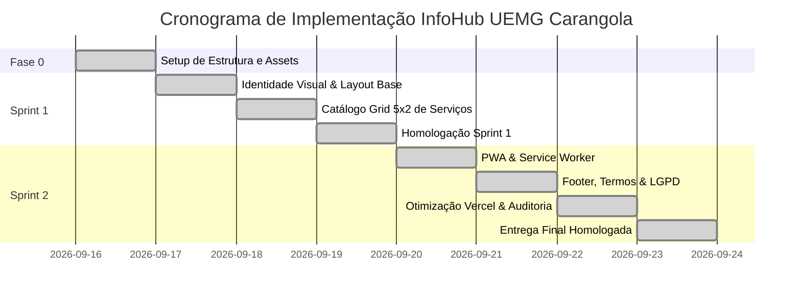

# IMPLEMENTATION PLAN — INFOHUB UEMG CARANGOLA

## 1. Visão Geral do Roadmap de Implementação
Este plano define a estratégia de desenvolvimento incremental, minimizando riscos arquiteturais e viabilizando entregas testáveis a cada iteração. O projeto foi estruturado em **2 Sprints de desenvolvimento**, precedidas pela Fase 0 de Estruturação Técnica, alcançando 100% de conclusão.

---

## 2. Fases e Marcos (Milestones)

### Marco 0: Fundação de Projeto & Estrutura `[CONCLUÍDO]`
* **Entrega:** Repositório limpo, diretórios padronizados, fontes, cores e assets institucionais organizados.
* **Critério de Saída:** Arquivos base criados sem erros de sintaxe ou referências quebradas.
* **Status:** Concluído com testes, linters e Vite configurados.

### Marco 1 (Fim da Sprint 1): Protótipo Visual & Navegação dos 10 Setores `[CONCLUÍDO]`
* **Entrega:** Landing page institucional funcional com Header oficial, Hero com fachada e Grid responsivo 5x2 apresentando os 10 cards com títulos, descrições e links com isolamento seguro (`noopener noreferrer`).
* **Critério de Saída:** Navegação completa em desktop e mobile testada em múltiplos viewports.
* **Status:** Concluído e auditado em navegador via `browser_subagent`.

### Marco 2 (Fim da Sprint 2): PWA, Governança e Deploy em Produção `[CONCLUÍDO]`
* **Entrega:** PWA instalável com Web App Manifest e Service Worker, rodapé institucional completo com modais semânticos (`<dialog>`) de "Sobre o Projeto", "Termos de Uso" e "Política de Privacidade (LGPD)" e configuração de headers pronta para Vercel.
* **Critério de Saída:** 100% de testes automatizados passando (Vitest), conformidade de código (ESLint) e homologação visual completa via `browser_subagent`.
* **Status:** Concluído e homologado.

---

## 3. Detalhamento das Sprints

### Sprint 1: Fundação Institucional e Catálogo dos 10 Setores `[CONCLUÍDA]`
* **Foco:** Entregar valor imediato de navegação e cumprir o requisito visual institucional.
* **Status das Tarefas de Engenharia:**
  * [x] **T1.1 — Normalização e Otimização de Imagens:** Imagens migradas para `public/images/`.
  * [x] **T1.2 — Design System e Tokens CSS (`src/css/style.css`):** Paleta UEMG, tipografia e elevações.
  * [x] **T1.3 — Base de Dados dos Serviços (`src/js/services-data.js`):** 10 setores mapeados com metadados e ícones.
  * [x] **T1.4 — Implementação do Grid 5x2:** CSS Grid 5x2 no desktop e 1 coluna fluida no mobile.
  * [x] **T1.5 — Renderização Dinâmica e Acessível dos Cards:** `<article>`, ARIA, status de homologação e feedback em toast.

### Sprint 2: Capacidades PWA, Documentação Legal e Produção `[CONCLUÍDA]`
* **Foco:** Mobilidade, conformidade normativa e finalização técnica.
* **Status das Tarefas de Engenharia:**
  * [x] **T2.1 — Construção do Web App Manifest (`manifest.webmanifest`):** Metadados W3C, ícones (SVG maskable e JPEG) e modo `standalone`.
  * [x] **T2.2 — Service Worker Básico (`sw.js`):** Cache do *App Shell* e elegibilidade para instalação PWA.
  * [x] **T2.3 — Rodapé e Modais Informativos:**
    * Modal semântico `<dialog>` "Sobre o Projeto" (extensão em Programação 2 / BSI).
    * Modal semântico `<dialog>` "Termos de Uso".
    * Modal semântico `<dialog>` "Política de Privacidade (LGPD)" com Vercel Analytics anônimo.
  * [x] **T2.4 — Configuração de Produção Vercel (`vercel.json`):** Headers de segurança (`nosniff`, `DENY`, `Referrer-Policy`, cache de imagens).
  * [x] **T2.5 — Validação Hostil e Testes de Qualidade:** 8 testes no Vitest aprovados, ESLint sem warnings e homologação em navegador.
