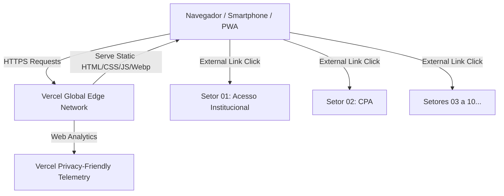

# PROJECT DNA — INFOHUB UEMG CARANGOLA

## 1. Visão do Projeto
O **InfoHub UEMG Carangola** é a plataforma institucional centralizadora de autoatendimento e navegação da Unidade Acadêmica de Carangola (UEMG). Construído no âmbito da extensão universitária curricularizada da disciplina de Programação 2 (Bacharelado em Sistemas de Informação), o Hub funciona como uma vitrine e ponto único de entrada seguro, padronizado e responsivo para 10 portais setoriais informacionais concebidos e mantidos pelos discentes.

## 2. Objetivos
* **Objetivo Geral:** Centralizar, padronizar e facilitar o acesso da comunidade acadêmica (discentes, docentes, técnicos e comunidade externa) às informações e serviços dos setores institucionais da UEMG Carangola.
* **Objetivos Específicos:**
  * Fornecer um portal de autoatendimento estético, rápido e aderente à identidade visual do portal oficial da UEMG (`https://www.uemg.br/`).
  * Operar como uma Aplicação Web Progressiva (PWA), permitindo instalação direta na tela de início de dispositivos móveis.
  * Garantir longevidade, custo zero de manutenção e autonomia de atualização para discentes e docentes.

## 3. Drivers Arquiteturais (Ordem de Prioridade)
1. **Custo (Prioridade 1 - Crítica):** Custo de infraestrutura e hospedagem estritamente R$ 0,00, sem servidores pagos, instâncias dedicadas ou dependências financeiras recorrentes.
2. **Manutenibilidade (Prioridade 2 - Alta):** Código inteligível, modular e desacoplado, permitindo que alunos de semestres iniciais e docentes alterem textos, links ou cartões com facilidade cirúrgica (abordagem orientada a dados).
3. **Segurança (Prioridade 3 - Alta):** Isolamento total em links externos (`noopener noreferrer`), políticas rigorosas de Content Security Policy (CSP), ausência de backend explorável e conformidade estrita com a LGPD.
4. **Performance / Leveza (Prioridade 4 - Alta):** Carregamento praticamente instantâneo (First Contentful Paint < 1s), zero overhead de frameworks pesados, assets otimizados e Core Web Vitals no percentil verde.
5. **Tempo de Entrega (Prioridade 5 - Média):** Execução pragmática e iterativa alinhada ao cronograma letivo sem desperdício de esforço em sobre-engenharia.
6. **Escalabilidade (Prioridade 6 - Moderada):** Suporte estático distribuído globalmente via Edge CDN (Vercel), absorvendo picos de matrícula ou início de semestre sem degradação.
7. **Disponibilidade (Prioridade 7 - Moderada):** Resiliência delegada à infraestrutura de alta disponibilidade da Vercel (SLA global padrão).

## 4. Restrições Invioláveis
* **Design e Identidade Visual:** Reproduzir fielmente os padrões de cores, tipografia, espaçamento e componentes visuais do portal oficial da UEMG (`https://www.uemg.br/`), utilizando as imagens institucionais locais (logos e fotos da fachada da Unidade Carangola).
* **Layout dos Setores:** Apresentar exatamente os 10 serviços setoriais em um grid balanceado de 5x2 (5 linhas x 2 colunas) em telas desktop/tablet largo, com adaptação fluida para 1 coluna no mobile (Mobile First).
* **Arquitetura Zero-Backend:** Proibição de bancos de dados gerenciados, microserviços ou servidores backend com estado.
* **Hospedagem e Custódia:** Hospedagem na Vercel integrada ao GitHub oficial, garantindo controle institucional permanente sobre forks e URLs.
* **Instalabilidade PWA:** Obrigatoriedade de Web App Manifest e Service Worker registrados para habilitar o fluxo nativo de "Adicionar à Tela de Início".
* **Conformidade Legal (LGPD):** Não retenção de dados pessoais identificáveis. Telemetria restrita às métricas anônimas e livres de cookies do Vercel Web Analytics.

## 5. Decisões por Dimensão

| Dimensão | Decisão Arquitetural |
|---|---|
| **1. Escopo e Propósito** | Hub agregador estático para autoatendimento acadêmico, sem retenção de sessão. |
| **2. Domínio de Negócio** | Catálogo dos 10 setores institucionais definidos no Guia de Extensão (Acesso Institucional, CPA, Estágios, Formatura, Horas Complementares, Pesquisa, Matrícula, Revista, NAE, TCC). |
| **3. Restrições Não Negociáveis** | Estilo UEMG oficial, Vercel free tier, GitHub, Mobile-first, PWA instalável. |
| **4. Atores e Segurança** | Acesso público anônimo; cabeçalhos de segurança HTTP modernos; links externos abertos em abas isoladas. |
| **5. Experiência de Uso** | Navegação rápida, cards com prévia descritiva, acessibilidade semântica e suporte a temas institucionais. |
| **6. Dados** | Configuração desacoplada de dados em estrutura declarativa JavaScript/JSON (`services-data.js`). |
| **7. Processamento** | Renderização client-side leve (ou estática pura com hidratação mínima de interações como modais de rodapé). |
| **8. Conectividade e Resiliência** | PWA com cache de assets essenciais via Cache Storage; sem suporte a modo offline completo para sites externos. |
| **9. Ecossistema Externo** | Conexão estrita via links HTTPS apontando para os repositórios/páginas sob controle institucional. |
| **10. Cultura Técnica** | HTML5 Semântico, CSS3 Modular (Vanilla BEM/Tokens) e JavaScript Moderno (Vanilla ES6+), compatível com o nível acadêmico de Programação 2. |
| **11. Operação e Observabilidade** | Continuous Deployment na Vercel a cada commit na branch `main`; Vercel Web Analytics para contagem de acessos sem cookies. |
| **12. Atributos de Qualidade** | Foco em máxima pontuação no Google Lighthouse (Performance, Acessibilidade, Boas Práticas, SEO e PWA). |

## 6. Arquitetura Lógica
* **Modelo Arquitetural:** JAMstack Estático Modular Client-Side.
* **Componentização Lógica:**
  * **Header Institucional:** Barra superior UEMG, logotipo oficial vetorizado/otimizado e título da Unidade de Carangola.
  * **Hero Informativo:** Banner institucional com a fachada de Carangola, contextualização e objetivo do Hub.
  * **Services Grid (5x2):** Renderizador declarativo dos 10 cards setoriais, contendo título, breve síntese explicativa e botão de ação externo.
  * **PWA Service Worker:** Registrador e gerenciador do ciclo de vida da aplicação para suporte a instalação mobile/desktop.
  * **Footer & Compliance Modals:** Navegação inferior contendo links modais para "Sobre o Projeto", "Termos de Uso" e "Política de Privacidade".

## 7. Arquitetura Física

## 8. Stack Tecnológica Justificada
* **HTML5 Semântico:** Garantia de indexação, acessibilidade (leitores de tela) e semântica pura sem overhead.
* **CSS3 Custom Properties (Design Tokens):** Implementação manual da paleta oficial UEMG (Azul Institucional, Vermelho/Laranja de destaque, tons neutros de cinza) e grid responsivo via CSS Grid/Flexbox sem dependência de Tailwind ou Bootstrap.
* **JavaScript ES6+ Puro:** Sem runtime pesado (como React, Angular ou Vue). O código permanece acessível para auditoria e evolução por qualquer estudante de graduação.
* **Web App Manifest + Service Worker nativo:** Habilitação do instalador PWA sem bibliotecas de terceiros.
* **Hospedagem Vercel (Hobby Tier):** Gratuita, build ultrarrápido, SSL automático e CDN global.

## 9. Estratégia de Segurança
* **Links Seguros:** Aplicação mandatória de `rel="noopener noreferrer"` e `target="_blank"` em todos os cards para impedir ataques de *tabnabbing* reverso.
* **Content Security Policy (CSP):** Configuração no `vercel.json` restringindo origens de scripts, imagens e fontes.
* **Headers HTTP:** Habilitação de `X-Content-Type-Options: nosniff`, `X-Frame-Options: DENY` e `Referrer-Policy: strict-origin-when-cross-origin`.

## 10. Estratégia de Dados
* Não há banco de dados relacional ou NoSQL.
* O catálogo de serviços é mantido em um arquivo de configuração centralizado (`src/data/services.js` ou equivalente), permitindo edição pontual de títulos, descrições e URLs com zero risco de corromper o layout HTML.

## 11. Estratégia Operacional
* Controle de versão via Git com fluxo de branch principal (`main`).
* Validação automática de sintaxe e linting via GitHub Actions (opcional, sem custo).
* Deploy contínuo ativado na Vercel com preview de deploys em pull requests.

## 12. Observabilidade
* Monitoramento de desempenho e acessos anônimos através do Vercel Web Analytics integrado.
* Auditoria periódica com Google Lighthouse para garantir pontuação 95+ em todos os quesitos.

## 13. Riscos e Mitigações
* **Risco 1: Links dos alunos tornarem-se indisponíveis ou estarem em desenvolvimento.**
  * *Mitigação:* Todos os links do Hub apontam estritamente para os forks na organização oficial da UEMG no GitHub. Caso algum projeto ainda esteja em fase de validação pelo setor, o cartão exibirá um badge visual "Em Validação / Em Breve" com link institucional temporário ou modal explicativo, impedindo erros 404.
* **Risco 2: Rejeição da instalação do PWA pelo navegador.**
  * *Mitigação:* Configuração precisa do `manifest.json` com ícones em resoluções padronizadas (192x192, 512x512, maskable) e Service Worker com estratégia de ativação limpa.
* **Risco 3: Divergência com a identidade institucional UEMG.**
  * *Mitigação:* Inspeção rigorosa dos tokens de cor, fontes institucionais e logos fornecidos na pasta `projeto/`.

## 14. Trade-offs Aceitos
* **Aceite de dependência de conexão para as páginas setoriais:** Em prol de custo zero e simplicidade arquitetural, o PWA não armazenará offline as 10 páginas externas, garantindo que o estudante sempre acesse as versões mais atualizadas nos servidores de cada projeto.
* **Vanilla Web em vez de Frameworks SPAs:** Menor atratividade imediata para pacotes npm complexos, porém máxima velocidade, legibilidade, longevidade e alinhamento total à ementa da disciplina de Programação 2.
